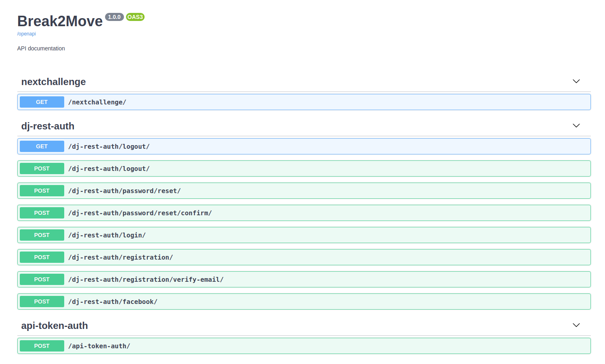

<h1 align="center">
  Break2Move - API
</h1>

  <a href="#-tecnologias">Technologies</a>&nbsp;&nbsp;&nbsp;|&nbsp;&nbsp;&nbsp;
  <a href="#-projeto">Project</a>&nbsp;&nbsp;&nbsp;|&nbsp;&nbsp;&nbsp;
  <a href="#-layout">Layout</a>&nbsp;&nbsp;&nbsp;|&nbsp;&nbsp;&nbsp;
  <a href="#-como-executar">How to execute</a>&nbsp;&nbsp;&nbsp;|&nbsp;&nbsp;&nbsp;
  <a href="#-licença">License</a>

  

 

  

## ✨ Technologies

This project was developed using the following back-end technologies:

- Python
- Django 
- Django Rest Framework
- Swagger

The front-end project is acessible in the following repository:
- [Frontend](https://github.com/robertoassuncaofilho/break2move)

## 💻 Project

Break2Move is an app that puts together the Pomodoro technique and healthy exercises for anyone who stays in front of the computer for a long time.
Developed during the [Rocketseat](https://rocketseat.com.br/) Next Level Week #4 bootcamp and incremented with a backend, login and registration functionalities by [Roberto Buarque](https://www.linkedin.com/in/roberto-assuncao-filho/).

## 🔖 Access

You can access the hosted project at [this link](https://break2move.robertobuarque.com)
API docs available at [this link](http://break2move.herokuapp.com/swagger-ui/)

## 🚀 How to execute

- Clone the repository
- Create and activate a virtualenv
- Install dependencies with `pip install -r requirements.txt`
- Run database migrations with `python manage.py migrate`
- Run using `python manage.py runserver`

Now you can access [localhost:8000](http://localhost:8000) from your browser.

## 📄 License

This project is under MIT license. See the file [LICENSE](LICENSE.md) to check the details.
